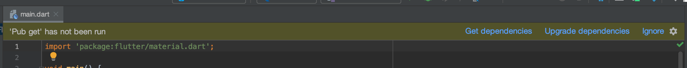

# sample-app-Flutter

## セットアップ

リポジトリーチェックアウトして、Android Studio を起動したときに、
以下のような警告が画面に表示されましたら



「Get dependencies」 リンクを押すか、

ターミナル上でか

```
pub pub get
```

を実行してから、Android Studio を再起動してください。（※再起動しないと警告が消えないです）

## AVD Manager メニューが表示されないとき

Tools メニューに AVD Manager が表示されていない場合の対処方法

- プロジェクト画面の「Help」→「Find Action」で「AVD」などの文字を入力して検索を実行
- 表示された AVD Manager をクリック

[Android Studio で AVD Manager が見つからない時の検索方法](https://getnews.jp/archives/2042178)

## 注意

注意！！！

```
flutter create second
```

コマンドで作成しているのでインストールされるファイル名など、second として表示されます。
